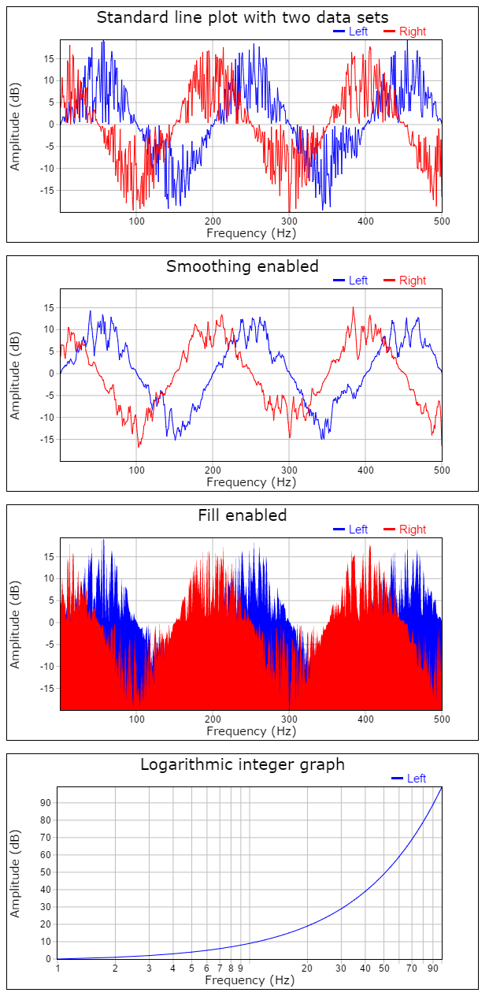

# OpenWebProject Graph
High performance graph plotter.

### Working examples and more info:
http://andreasarvidsson.github.io/OpenWebProject-Graph

### Project concept
The project is based on four core ideas:
* Performance: The ability to plot several million coordinates in a short time span is essential and Graph has been written with performance in mind.
* Customizability: To be able to tweak the software to your needs without having to rewrite the code. Graph has a large amount of different options that can be set.
* Easy to use: A software shouldn't be complicated to use. Graph is easy to get started with.
* Code readability and maintainability: The code is easy to read and well commented. Any one wanting to fork this project should be able to do so.

# Usage

Import
```javascript
import Graph from "owp.graph";
```

Create instance
```javascript
const graph = Graph(parentDom, options);
```

```javascript
const graph = Graph(
    document.getElementById("root"), 
    {
        "title": {
            "label": "Standard line plot with two data sets"
        },
        "axes": {
            "x": {
                "label": "Frequency (Hz)"
            },
            "y": {
                "label": "Amplitude (dB)"
            }
        },
        "graph": {
            names: ["Left", "Right"],
            dataY: [
                [100, 200, 400]
            ],
            "dataY": [
                [1, 2, 3],
                [1.5, 2.5, 3.5]
            ]
        }
    }
);
```

# Examples


# Options explained
Most of the options are pretty straight forward like labels, colors, offset and so on and the JSDoc should be enough, but some of them are more esoteric and require a more detailed explanation.

## graph.dataX and graph.dataY
These are the arrays that contain the actual data to plot. They are standard JavaScript Array() instances and they contain arrays of data to plot. So dataX and dataY are arrays of arrays.

### Data types
dataX and dataY are always standard JS arrays, but the inner arrays that hold the actual data can be either a standard JS array or a typed array(uint8, int32, float32..).

The data in the inner arrays can be any number.

### Length of arrays
The inner arrays in dataY hold the Y-axis values for each coordinate. Each new inner array will create a new line to plot on the graph.

The inner arrays in dataX hold the X-axis values for each coordinate. dataX doesn't neccessary need to contain the same number of inner arrays as dataY. The X-coordinates can be implicit.

There are three different possibilities for the coordinates to be interpreted.
* dataX.length == 0: Each coordinate gets the implicit X-value of n+1.    
Coordinate: { n+1, dataY[i][n] }
* dataX.length == 1: Each inner array in dataY uses the same inner array in dataX.    
Coordinate: { dataX[0][n], dataY[i][n] }
* dataX.length == dataY.length: Each inner array in dataY has each own inner array in dataX.    
Coordinate: { dataX[i][n], dataY[i][n] }

NOTE: If dataX has length 0 or 1, then we only have one (implicit or explicit) data set for X. Each inner array in dataY has to have the same length.

NOTE: If dataX has length greater than 1, then dataY.length must be equal to dataX.length and dataY[i].length must be equal to dataX[i].length.

### Why use separate X and Y arrays?
Many other similar systems use matrices or an arrays of objects to describe each coordinate. Graph on the other hand uses separate X and Y arrays. This has several advantages:

* Increased performance. Accessing members is costly in JavaScript so instead of having to do data[i][1] or data[i].y Graph just do dataY[i].
* Implicit X-coordinates. Less data thats needs processing. Use custom value formatter to get the output you want for X.
* One X for each Y. Possible to plot data sets that have different length and distribution. Not possible with format: {x, y1, y2, y3}
* Can use typed arrays. Less CPU overhead, more memory efficient, possible to transfer between web workers and so on.

## graph.smoothing
Number of samples on each side of the central value for the central moving average algorithm. Window size = 2 * smoothing + 1. If enabled works as a low pass filter to remove noise(very quick changes). Makes reading the average trend easier in noisy data. Higher values will smooth out the line more. Set to 0 to disable.

## graph.simplify
Tolerance of the simplification algorithm in pixels. Used to "simplify" the data set by grouping together Y-values with similar X-pixel coordinates. The purpose of the algorithm is to increase performance by plotting less data and still retain the look of the graph curve. Set to 0 to disable.    

Pseudo code:
```
if |pixelXOld - pixelX[n]| < simplify:
    valueYMin = min(valueYMin, valueY[n])
    valueYMax = max(valueYMax, valueY[n])
else:
    plot(x, pixelYMin)
    plot(x, pixelYMax)
```

## Tickers
graph.axes.x.ticker and graph.axes.y.ticker
Callback function given by the user to create the axis ticks(value and text of labels). See JSDoc for details on arguments and return type. If null the default ticker is used.

## Value formatters
graph.axes.x.valueFormatter and graph.axes.y.valueFormatter
Callback function given by the user to format legend values. See JSDoc for details on arguments and return type. If null the default "rounded value" formatter is used.

## Ticker formatters
graph.axes.x.tickerFormatter and graph.axes.y.tickerFormatter
Callback function given by the user to format axis labels. See JSDoc for details on arguments and return type. If null the default SI-unit formatter is used.